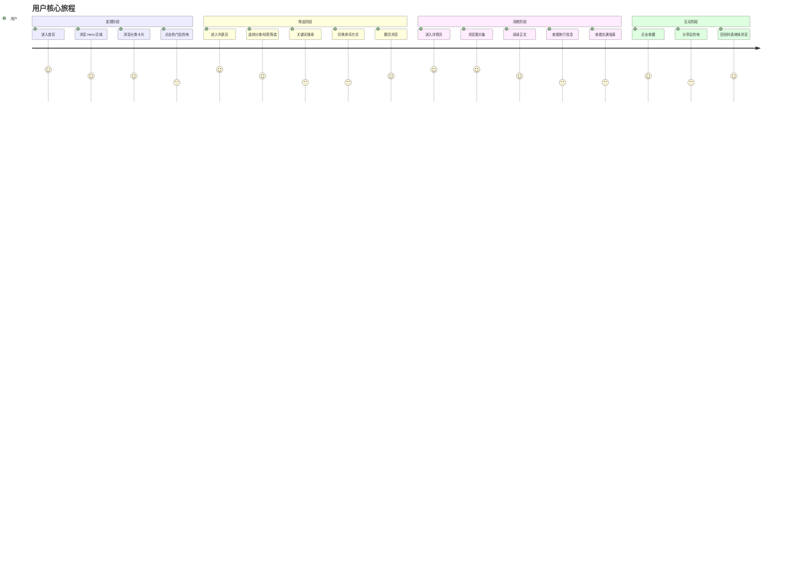
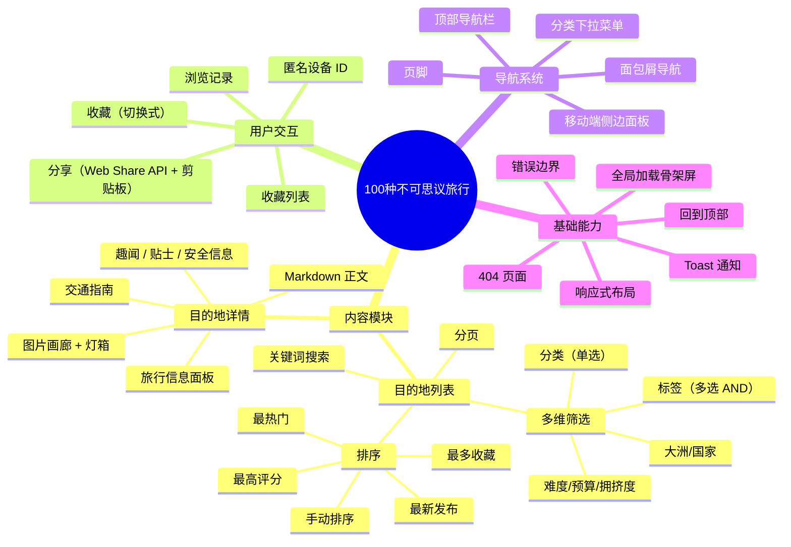
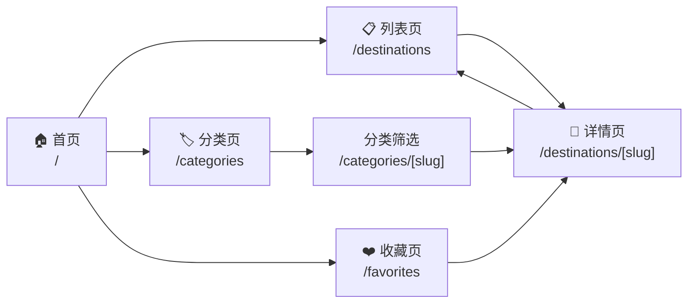
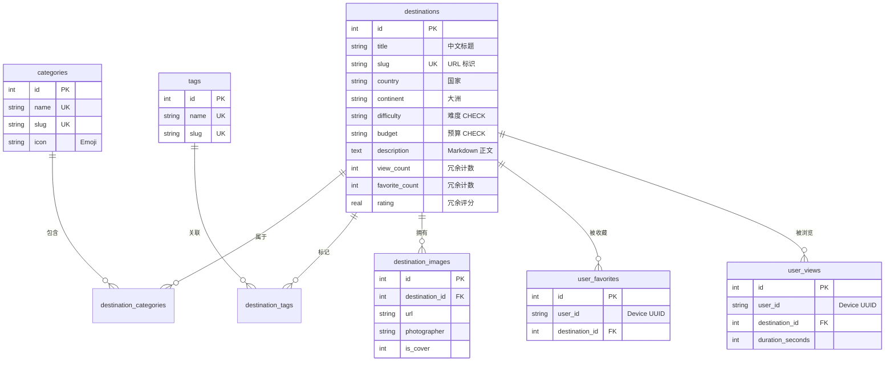
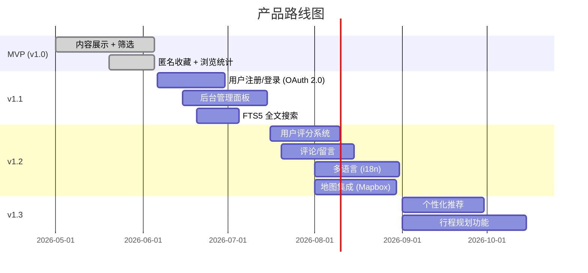

# 产品需求文档 (PRD) — 「100种不可思议旅行」

> **版本**: v1.0 MVP  
> **日期**: 2026-06-05  
> **状态**: 已交付  
> **文档类型**: 产品需求文档 (Product Requirements Document)

---

## 目录

1. [产品概述](#1-产品概述)
2. [目标用户与场景](#2-目标用户与场景)
3. [功能范围 (MVP)](#3-功能范围-mvp)
4. [产品架构](#4-产品架构)
5. [功能详述](#5-功能详述)
6. [页面结构](#6-页面结构)
7. [数据模型概览](#7-数据模型概览)
8. [非功能需求](#8-非功能需求)
9. [版本规划](#9-版本规划)
10. [附录](#10-附录)

---

## 1. 产品概述

### 1.1 产品定位

「100种不可思议旅行」是一个**内容驱动的旅行目的地展示平台**。产品聚焦于筛选、呈现全球范围内具有视觉冲击力、故事性和稀缺性的小众旅行目的地，通过高质量图文内容激发用户的旅行灵感。

### 1.2 核心理念

传统旅行攻略以「实用性」为核心（酒店、交通、价格），而本产品以「不可思议」为筛选标准——只为那些让人感叹"地球上居然有这样的地方"的目的地提供深度内容。

### 1.3 产品目标 (MVP)

| 目标 | 衡量指标 | 优先级 |
|------|---------|--------|
| 内容展示 | 100 个目的地上线，每个含完整图文详情 | P0 |
| 内容发现 | 支持按分类/标签/大洲/难度等多维筛选 | P0 |
| 轻量互动 | 匿名收藏 + 浏览统计 | P1 |
| 响应式体验 | 移动端 / 平板 / 桌面三端适配 | P1 |
| 性能基线 | FCP < 1.5s, 列表页 TTI < 3s | P2 |

### 1.4 用户旅程地图



---

## 2. 目标用户与场景

### 2.1 用户画像

| 画像 | 描述 | 核心需求 |
|------|------|---------|
| **旅行灵感寻求者** | 25-40 岁，喜欢小众旅行，厌倦大众景点。在规划下一次旅行前寻找灵感。 | 通过视觉冲击力强的内容发现「值得去」的目的地 |
| **沙发旅行者** | 20-35 岁，喜欢在工作间隙浏览世界奇观，不一定真正出发。 | 「云旅行」体验——高质量图片和有趣的知识点 |
| **旅行博主/创作者** | 寻找内容灵感和素材的创作者。 | 获取目的地数据和旅行实用信息 |

### 2.2 核心使用场景

| 场景编号 | 场景描述 | 频率 |
|---------|---------|------|
| S1 | 用户在首页浏览热门目的地，点击感兴趣的卡片进入详情 | 高 |
| S2 | 用户通过分类（"自然奇观"）筛选目的地列表，逐一浏览 | 高 |
| S3 | 用户通过标签组合（"星空摄影"+"此生必去"）交叉筛选 | 中 |
| S4 | 用户在详情页浏览完整图集，查看交通/签证等实用信息 | 中 |
| S5 | 用户收藏感兴趣的目的地，在"我的收藏"中回顾 | 中 |
| S6 | 用户通过分享按钮将目的地分享给朋友 | 低 |

---

## 3. 功能范围 (MVP)

### 3.1 功能清单



### 3.2 MVP 明确不做

| 项目 | 原因 | 计划版本 |
|------|------|---------|
| 用户注册/登录 | MVP 使用 device UUID 匿名标识 | v1.1 |
| 用户评分系统 | 需要登录 + 更复杂的防刷机制 | v1.2 |
| 评论/留言 | 需要内容审核 + 用户系统 | v1.2 |
| 后台管理面板 | 种子数据通过 API + JSON 管理 | v1.1 |
| 文章推荐算法 | 当前手动排序 + 点击排序已够用 | v1.3 |
| 多语言 (i18n) | 首批内容以中文为主 | v1.2 |
| 地图集成 | 需要 Mapbox/Google Maps 付费 API | v1.2 |
| 全文搜索 | 当前 LIKE 模糊搜索可满足基本需求 | v1.1 |

---

## 4. 产品架构

```mermaid
flowchart TB
    subgraph 用户端["🖥️ 用户端 (Browser)"]
        direction TB
        NextApp["Next.js 14<br/>App Router"]
        RSC["React Server Components<br/>数据获取 + SSR 渲染"]
        CSC["React Client Components<br/>筛选/收藏/灯箱/交互"]
        Providers["Context Providers<br/>Device > Toast > Favorites"]
    end

    subgraph API层["🔌 API 层 (FastAPI)"]
        direction TB
        DestRouter["/destinations<br/>列表 + 详情"]
        CatRouter["/categories"]
        TagRouter["/tags"]
        UserRouter["收藏 + 浏览 + 收藏列表"]
        StaticFiles["/images<br/>静态文件服务"]
    end

    subgraph 数据层["💾 数据层"]
        SQLite[("SQLite 3<br/>WAL 模式")]
        Schema["7 张表 | 10+ 索引 | 1 触发器"]
    end

    NextApp -->|HTTP + CORS| API层
    RSC -->|fetch()| API层
    CSC -->|fetch()| API层
    Providers -->|localStorage| 用户端
    API层 -->|sqlite3| SQLite
    StaticFiles -->|FileResponse| Schema
```

---

## 5. 功能详述

### 5.1 目的地列表 (FL-001)

**用户故事**: 作为一名旅行灵感寻求者，我希望能够通过多种条件筛选和排序目的地，快速找到我感兴趣的内容。

**入口**: 导航栏「探索目的地」链接、首页分类卡片、首页"查看全部"按钮

**核心交互**:
1. 筛选面板支持 6 个维度：分类、标签、大洲、难度、预算、拥挤度
2. 标签支持多选（AND 逻辑），其余单选
3. 5 种排序方式：默认排序、最新、最热门、最多收藏、最高评分
4. 关键词搜索（标题模糊匹配）
5. 移动端：筛选面板折叠为抽屉式展开
6. 分页：移动端显示"上一页/下一页"，桌面端显示完整页码

**边界情况**:
- 无结果时展示空状态插图和提示文字
- page_size 上限 100，超出返回 400
- 标签 AND 逻辑意味着同时匹配所有选中标签

### 5.2 目的地详情 (FL-002)

**用户故事**: 作为一名沙发旅行者，我希望看到目的地的高质量图片和深度文字内容，获得"身临其境"的体验。

**入口**: 列表页卡片点击、首页卡片点击、收藏列表点击

**核心交互**:
1. 左侧图片画廊：主图 + 缩略图条，点击打开全屏灯箱
2. 灯箱支持键盘导航（← → 切换，Esc 关闭）、触摸滑动
3. 右侧/下方信息面板：使用 Tab 切换（旅行信息 / 实用信息 / 交通指南 / 贴士 / 趣闻）
4. 收藏按钮（心形动画）+ 分享按钮
5. 面包屑导航：首页 > 目的地列表 > 当前目的地
6. ViewTracker 记录浏览（进页触发 view，离页通过 sendBeacon 发送停留时长）

### 5.3 收藏系统 (FL-003)

**用户故事**: 作为一名旅行灵感寻求者，我希望将感兴趣的目的地收藏起来，稍后统一查看。

**技术设计**:
- 基于 device UUID（localStorage）的匿名标识
- 切换式收藏（POST 同一接口，已收藏则取消）
- 前端乐观更新 + 后端同步，失败时回滚
- 心形按钮动画：收藏成功时触发 `heart-beat` CSS 动画

### 5.4 分类与标签系统 (FL-004)

**分类**: 互斥分组（一个目的地可属于多个分类，但通常一个为主）
**标签**: 扁平化跨分类标注（如"星空摄影"可同时标注自然奇观和地下秘境类目的地）

8 个预设分类，8 个预设标签（见 [数据模型概览](#7-数据模型概览)）。

---

## 6. 页面结构

```
/                         首页 (Hero + 热门 + 最新 + 分类)
/destinations             目的地列表（筛选 + 搜索 + 分页）
/destinations/[slug]      目的地详情（图集 + 正文 + 信息面板）
/categories               全部分类
/categories/[slug]        分类筛选的目的地列表
/favorites                我的收藏 (客户端页面)
```

### 6.1 页面层级关系



### 6.2 页面状态矩阵

| 页面 | 正常 | 加载中 | 空数据 | 错误 | 404 |
|------|------|--------|--------|------|-----|
| 首页 | ✅ | ✅ (SkeletonCard × 8) | ❌ (始终有数据) | ✅ (error.tsx) | — |
| 列表页 | ✅ | ✅ (SkeletonCard × 8) | ✅ (空状态插画) | ✅ (error.tsx) | — |
| 详情页 | ✅ | ✅ (2 列骨架) | — | ✅ | ✅ (not-found.tsx) |
| 分类页 | ✅ | 复用列表页骨架 | 复用列表页空状态 | ✅ | — |
| 收藏页 | ✅ | ✅ | ✅ (空收藏提示) | ✅ | — |

---

## 7. 数据模型概览

### 7.1 核心实体



### 7.2 预设分类 (MVP)

| ID | 名称 | Slug | 图标 |
|----|------|------|------|
| 1 | 自然奇观 | natural-wonders | 🌋 |
| 2 | 地下秘境 | underground-wonders | 🕳️ |
| 3 | 色彩之地 | chromatic-places | 🎨 |
| 4 | 遗世之地 | remote-escapes | 🏚️ |
| 5 | 人造奇观 | man-made-wonders | 🏛️ |
| 6 | 水域幻境 | aquatic-wonders | 💧 |
| 7 | 天空之境 | sky-mirrors | 🌌 |
| 8 | 远古密码 | ancient-mysteries | 🗿 |

### 7.3 预设标签 (MVP)

| ID | 名称 | Slug |
|----|------|------|
| 1 | 星空摄影 | astrophotography |
| 2 | 无人机必飞 | drone-friendly |
| 3 | 日出日落 | sunrise-sunset |
| 4 | 洞穴探险 | caving |
| 5 | 被低估 | underrated |
| 6 | 此生必去 | bucket-list |
| 7 | INS网红 | instagrammable |
| 8 | 生态奇观 | ecological |

---

## 8. 非功能需求

### 8.1 性能要求

| 指标 | 目标值 | 测量方式 |
|------|--------|---------|
| First Contentful Paint | < 1.5s | Lighthouse |
| Time to Interactive | < 3s | Lighthouse |
| API 响应时间 (列表) | < 200ms | 服务器端计时 |
| API 响应时间 (详情) | < 100ms | 服务器端计时 |
| 图片加载 (LCP) | < 2.5s | Lighthouse |
| Next.js 构建时间 | < 60s | CI 计时 |

### 8.2 兼容性要求

| 平台 | 要求 |
|------|------|
| 浏览器 | Chrome 90+, Firefox 90+, Safari 15+, Edge 90+ |
| 移动端 | iOS Safari 15+, Android Chrome 90+ |
| 屏幕宽度 | 320px (最小) ~ 2560px (4K) |

### 8.3 国际化

MVP 阶段：
- 前端 UI 文字：中文
- 目的地方向：主标题中文，`title_en` 提供英文备用
- 字体：Inter (Latin) + Noto Sans SC (Chinese)

### 8.4 安全要求

| 项目 | 措施 |
|------|------|
| XSS | React 默认转义 + Markdown 内容服务端处理 |
| 静态文件路径遍历 | 服务端 resolve + prefix 校验 |
| CORS | 仅允许 localhost:3000 / 127.0.0.1:3000 |
| SQL 注入 | 参数化查询（全部 SQL 使用 `?` 占位符） |
| Cookie 合规 | 不使用 Cookie（device UUID 存储在 localStorage） |

---

## 9. 版本规划



---

## 10. 附录

### 10.1 术语表

| 术语 | 定义 |
|------|------|
| Device UUID | 存储在浏览器 localStorage 中的匿名标识符，用于标识匿名用户，格式为 UUID v4 |
| M2M | Many-to-Many，多对多关系 |
| Slug | URL 友好的唯一标识字符串，如 `salar-de-uyuni` |
| WAL | Write-Ahead Logging，SQLite 的日志模式，提升并发读写性能 |
| RSC | React Server Components，在服务端渲染的 React 组件 |
| sendBeacon | 浏览器 API，用于在页面卸载时可靠发送数据 |

### 10.2 参考文档

- [API 契约文档](./api_spec.md)
- [数据库设计文档](./database-design.md)
- [架构设计文档](./architecture.md)
- [前端组件结构文档](./frontend-architecture.md)

---

> **版本历史**  
> - v1.0 (2026-06-05) — MVP PRD 初版，覆盖内容消费与轻量交互的全部需求
