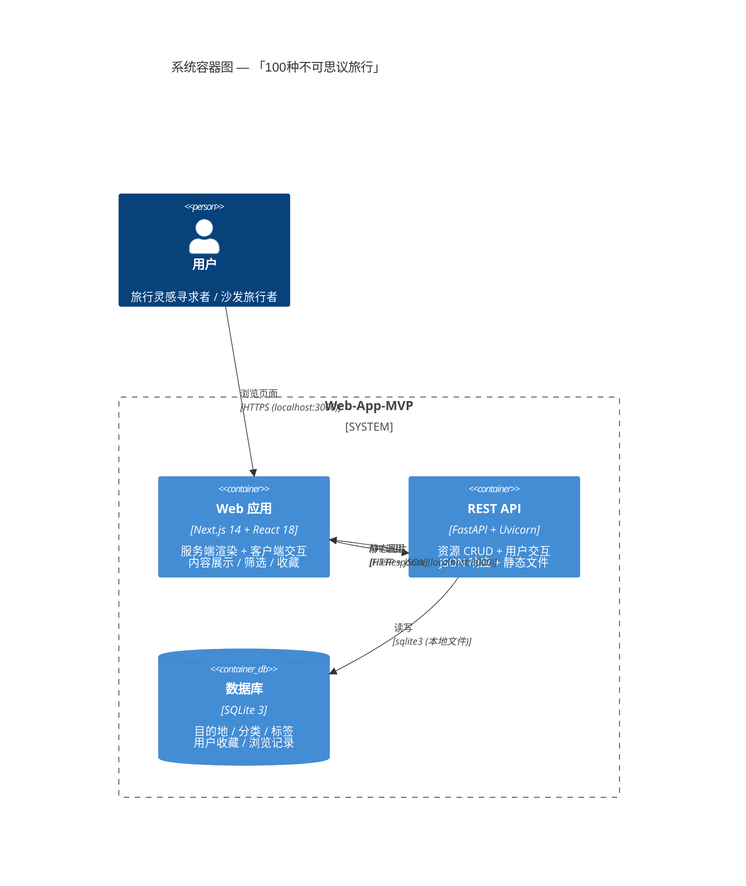
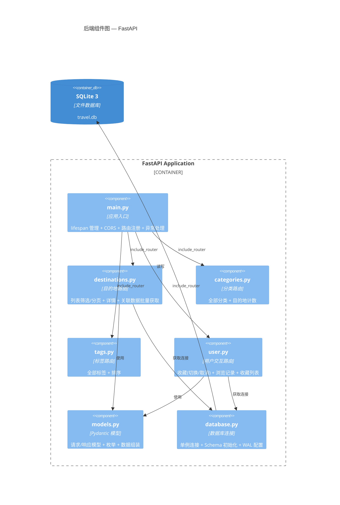
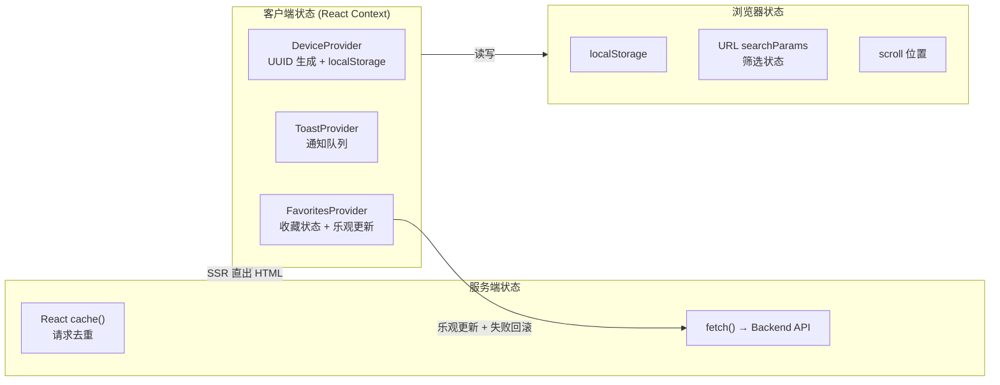
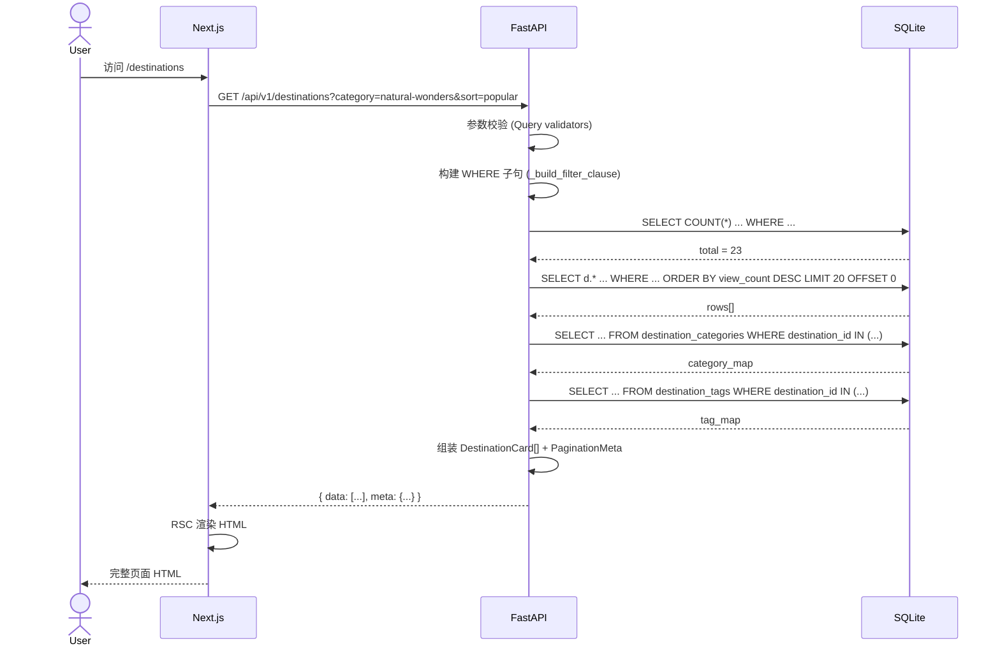
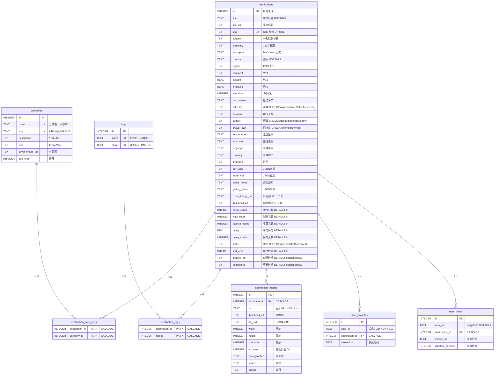
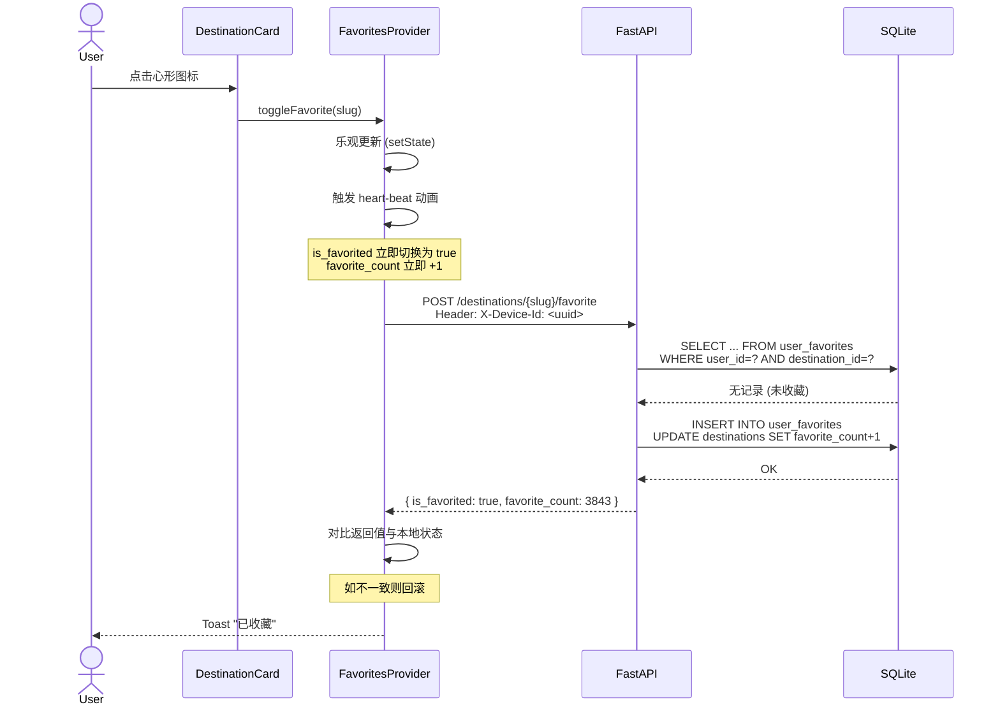
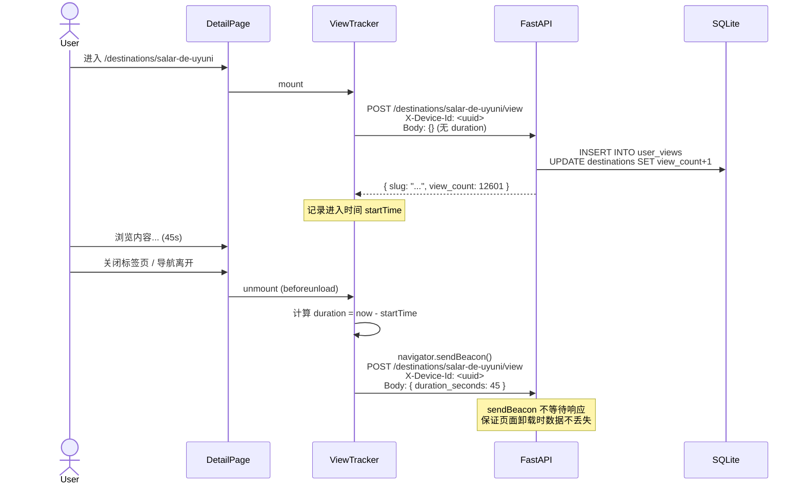
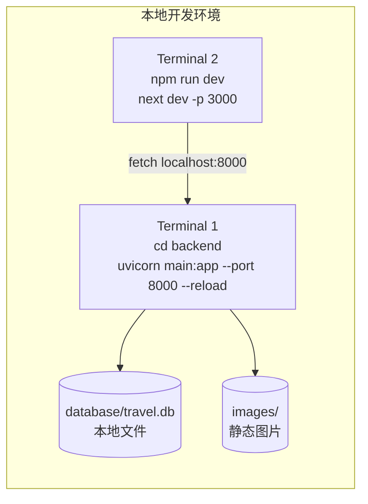
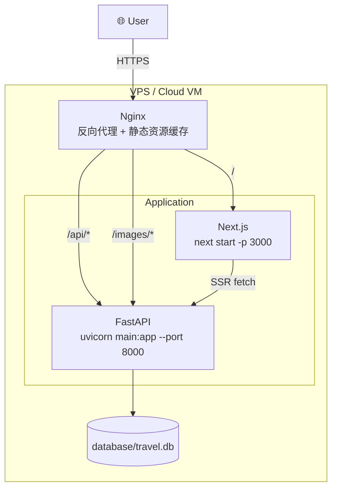

# 架构设计文档 — 「100种不可思议旅行」

> **版本**: v1.0 MVP  
> **日期**: 2026-06-05  
> **文档类型**: 技术架构设计文档

---

## 目录

1. [架构总览](#1-架构总览)
2. [技术选型](#2-技术选型)
3. [系统架构图](#3-系统架构图)
4. [前端架构](#4-前端架构)
5. [后端架构](#5-后端架构)
6. [数据库设计](#6-数据库设计)
7. [数据流](#7-数据流)
8. [部署架构](#8-部署架构)
9. [关键设计决策](#9-关键设计决策)

---

## 1. 架构总览

本项目采用**前后端分离**的单体架构，前端为 Next.js 14 SPA/SSR 混合应用，后端为 Python FastAPI REST API，数据存储使用 SQLite 3。

```
┌──────────────────────────┐     HTTP/CORS     ┌──────────────────────┐
│   Next.js 14 (port 3000) │ ◄──────────────► │  FastAPI (port 8000)  │
│   React 18 + TypeScript  │                   │  Python 3.12          │
│   Tailwind CSS + Lucide  │                   │  Uvicorn ASGI         │
└──────────┬───────────────┘                   └──────────┬───────────┘
           │                                              │
           │  localStorage                                 │  sqlite3
           ▼                                              ▼
    ┌──────────────┐                            ┌──────────────────┐
    │  Device UUID  │                            │  SQLite 3 (WAL)  │
    │  Favorites    │                            │  database/travel │
    │  Toast State  │                            │  .db             │
    └──────────────┘                            └──────────────────┘
```

---

## 2. 技术选型

### 2.1 选型对比

| 层面 | 选择 | 备选方案 | 选择理由 |
|------|------|---------|---------|
| **前端框架** | Next.js 14 (App Router) | Nuxt 3 / Remix / SvelteKit | React 生态成熟，服务端组件天然适合内容型站点 SEO |
| **语言** | TypeScript (strict) | JavaScript | 类型安全，API 契约可被前后端共享（Pydantic ↔ TS types） |
| **样式方案** | Tailwind CSS 3 | CSS Modules / Styled Components | 原子化 CSS 构建速度快，与 Next.js 集成最好 |
| **图标库** | Lucide React | Heroicons / Phosphor | 图标数量多（400+），tree-shakable，风格一致 |
| **后端框架** | FastAPI | Flask / Django Ninja | 原生 async 支持，自动 OpenAPI 文档，Pydantic 集成 |
| **ASGI 服务器** | Uvicorn | Gunicorn + Uvicorn workers | MVP 阶段单 worker 足够，部署简单 |
| **数据库** | SQLite 3 (WAL) | PostgreSQL / MySQL | 零配置部署，MVP 数据量小（< 1GB），WAL 模式满足低并发读写 |
| **包管理 (Python)** | pip + requirements.txt | Poetry / PDM | 依赖少（仅 fastapi + uvicorn），无复杂依赖树 |
| **包管理 (Node)** | npm | pnpm / yarn | Next.js 默认工具链，零配置 |

### 2.2 技术栈全景

| 类别 | 技术 | 版本 |
|------|------|------|
| **前端运行时** | Node.js | ≥ 20 LTS |
| **前端框架** | Next.js (App Router) | 14.2 |
| **UI 库** | React | 18.3 |
| **类型系统** | TypeScript | 5.4 |
| **样式** | Tailwind CSS | 3.4 |
| **排版** | @tailwindcss/typography | 0.5 |
| **图标** | lucide-react | 0.400 |
| **后端运行时** | Python | ≥ 3.12 |
| **后端框架** | FastAPI | 0.115 |
| **ASGI 服务器** | Uvicorn | 0.30 |
| **数据验证** | Pydantic | 2.x (内置于 FastAPI) |
| **数据库** | SQLite 3 | ≥ 3.35 |
| **数据库驱动** | sqlite3 (标准库) | — |
| **字体** | Inter + Noto Sans SC | Google Fonts (next/font) |

---

## 3. 系统架构图

### 3.1 C4 — 容器图



### 3.2 C4 — 组件图（后端）



### 3.3 C4 — 组件图（前端）

```mermaid
C4Component
    title 前端组件图 — Next.js App Router

    Container_Boundary(nextjs, "Next.js Application") {
        Component(layout, "layout.tsx", "根布局", "字体 + 元数据 + Providers 嵌套")
        Component(providers, "providers.tsx", "Provider 链", "DeviceProvider > ToastProvider > FavoritesProvider")
        Component(home, "page.tsx (/)", "首页", "Hero + 热门 + 最新 + CTA")
        Component(list_page, "page.tsx (/destinations)", "列表页", "FilterBar + SearchBar + Grid + Pagination")
        Component(detail_page, "page.tsx (/destinations/[slug])", "详情页", "DetailLayout + ViewTracker")
        Component(fav_page, "page.tsx (/favorites)", "收藏页", "客户端页面")

        Component(atoms, "atoms/ (12)", "基础组件", "Button/Badge/Tag/Skeleton/Image...")
        Component(molecules, "molecules/ (12)", "组合组件", "DestinationCard/FavoriteButton/FilterGroup...")
        Component(organisms, "organisms/ (10)", "区块组件", "Navbar/Footer/Hero/FilterBar/ImageGallery/Pagination...")
        Component(templates, "templates/ (2)", "布局模板", "MainLayout/DetailLayout")
        Component(hooks, "hooks/ (4)", "自定义 Hooks", "useDeviceId/useDebounce/useScrollPosition/useRecordView")
        Component(lib, "lib/ (3)", "工具库", "api-client/api-errors/data")
    }

    Rel(layout, providers, "包裹")
    Rel(home, templates, "使用")
    Rel(list_page, templates, "使用")
    Rel(detail_page, templates, "使用")
    Rel(fav_page, templates, "使用")
    Rel(templates, organisms, "组合")
    Rel(organisms, molecules, "组合")
    Rel(molecules, atoms, "组合")
    Rel(list_page, hooks, "使用")
    Rel(detail_page, hooks, "使用")
    Rel(lib, "fetch", "→ Backend API")
```

---

## 4. 前端架构

### 4.1 组件设计方法论：Atomic Design

```mermaid
flowchart TD
    subgraph Templates["📐 Templates (2)"]
        MainLayout["MainLayout<br/>页面级 chrome"]
        DetailLayout["DetailLayout<br/>详情页 chrome"]
    end

    subgraph Organisms["🧩 Organisms (10)"]
        Navbar["Navbar"]:::org
        Footer["Footer"]:::org
        HeroSection["HeroSection"]:::org
        FilterBar["FilterBar"]:::org
        DestinationGrid["DestinationGrid"]:::org
        ImageGallery["ImageGallery"]:::org
        MarkdownViewer["MarkdownViewer"]:::org
        TravelInfoPanel["TravelInfoPanel"]:::org
        Pagination["Pagination"]:::org
        ScrollToTop["ScrollToTop"]:::org
    end

    subgraph Molecules["🔗 Molecules (12)"]
        DestinationCard["DestinationCard"]
        SkeletonCard["SkeletonCard"]
        FilterGroup["FilterGroup"]
        FavoriteButton["FavoriteButton"]
        RatingStar["RatingStar"]
        StatBadge["StatBadge"]
        Breadcrumb["Breadcrumb"]
        TagChip["TagChip"]
        CategoryBadge["CategoryBadge"]
        SearchBar["SearchBar"]
        BackToTop["BackToTop"]
        ShareButton["ShareButton"]
    end

    subgraph Atoms["⚛️ Atoms (12)"]
        Button["Button"]
        Badge["Badge"]
        Tag["Tag"]
        Spinner["Spinner"]
        Skeleton["Skeleton"]
        Icon["Icon"]
        Input["Input"]
        Select["Select"]
        Tooltip["Tooltip"]
        Divider["Divider"]
        Typography["Typography"]
        OptimizedImage["OptimizedImage"]
    end

    Templates --> Organisms
    Organisms --> Molecules
    Molecules --> Atoms

    classDef org fill:#e1f5fe,stroke:#0288d1
```



### 4.2 渲染策略

| 页面 | 渲染策略 | 原因 |
|------|---------|------|
| `/` (首页) | Server Component | 数据静态、SEO 关键、无交互状态 |
| `/destinations` | Server Component | 默认视图可服务端渲染，筛选参数通过 URL searchParams 传递 |
| `/destinations/[slug]` | Server Component | 内容页，SEO 核心（generateMetadata） |
| `/categories` / `/[slug]` | Server Component | 数据静态 |
| `/favorites` | Client Component | 完全依赖客户端 device UUID |

**混合渲染模式**：页面主体是 Server Component（在服务端 fetch 数据），交互部分作为 Client Component Islands 嵌入（FilterBar 的展开/收起、FavoriteButton 的心形点击、ImageGallery 的灯箱）。

### 4.3 状态管理



---

## 5. 后端架构

### 5.1 路由设计

```
/api/v1/
├── health                          GET    健康检查
├── admin/seed                      POST   加载种子数据（开发用）
├── destinations                    GET    列表（筛选/排序/分页）
├── destinations/{slug}             GET    详情
├── destinations/{slug}/favorite    POST   切换收藏 (幂等)
├── destinations/{slug}/favorite    DELETE 取消收藏
├── destinations/{slug}/view        POST   记录浏览
├── categories                      GET    全部分类
├── tags                            GET    全部标签
└── user/favorites                  GET    用户收藏列表
```

### 5.2 请求处理流程



### 5.3 错误处理层次

```
Layer 1: FastAPI 内置验证 → 422 Validation Error (参数格式错误)
Layer 2: 路由级校验 → 400 / 401 (业务参数错误)
Layer 3: 数据库查询 → 404 / 410 (资源不存在)
Layer 4: 全局 Exception Handler → 500 (未预料的异常)
```

---

## 6. 数据库设计

### 6.1 完整 ER 图



### 6.2 索引设计

| 索引名 | 列 | 用途 | 类型 |
|--------|---|------|------|
| `idx_destinations_status` | `status` | 只查询已发布内容 | 普通索引 |
| `idx_destinations_continent` | `continent` | 按大洲筛选 | 普通索引 |
| `idx_destinations_country` | `country` | 按国家筛选 | 普通索引 |
| `idx_destinations_difficulty` | `difficulty` | 按难度筛选 | 普通索引 |
| `idx_destinations_budget` | `budget` | 按预算筛选 | 普通索引 |
| `idx_destinations_favorite_count` | `favorite_count DESC` | 收藏排序 | 降序索引 |
| `idx_destinations_view_count` | `view_count DESC` | 热门排序 | 降序索引 |
| `idx_destination_images_dest` | `destination_id` | 查询图片集 | 外键索引 |
| `idx_user_favorites_user` | `user_id` | 查询用户收藏 | 普通索引 |
| `idx_user_favorites_dest` | `destination_id` | 查询某目的地收藏数 | 普通索引 |
| `idx_user_views_user` | `user_id` | 查询用户浏览历史 | 普通索引 |
| `idx_user_views_dest` | `destination_id` | 查询某目的地浏览数 | 普通索引 |
| `idx_user_views_time` | `viewed_at DESC` | 按时间排序浏览记录 | 降序索引 |

### 6.3 触发器

| 触发器 | 时机 | 作用 |
|--------|------|------|
| `trg_destinations_updated_at` | AFTER UPDATE ON destinations | 自动更新 `updated_at` 为当前时间 |

---

## 7. 数据流

### 7.1 收藏操作流程



### 7.2 浏览记录流程



---

## 8. 部署架构

### 8.1 开发环境



### 8.2 生产环境（推荐）



> **注意**: SQLite 在单服务器部署下完全够用。如需水平扩展，应迁移至 PostgreSQL 并使用共享存储或 CDN 分发图片。

---

## 9. 关键设计决策

### 9.1 决策记录

| ID | 决策 | 理由 | 权衡 |
|----|------|------|------|
| ADR-001 | 使用匿名 Device UUID 而非用户系统 | MVP 不需要用户注册，降低开发复杂度和合规负担 | 收藏数据无法跨设备同步，无法防止刷量 |
| ADR-002 | 冗余计数而非实时 COUNT | 列表排序需要 `ORDER BY favorite_count`，实时 COUNT 性能差 | 需要维护一致性（应用层 + 未来触发器） |
| ADR-003 | 列表型数据存为 JSON 字符串 | `fun_facts`/`travel_tips` 始终整体读写，无需跨行查询 | 无法按单个 fact/tip 搜索（可用 FTS5 弥补） |
| ADR-004 | 静态图片通过 FastAPI 路由服务 | 避免 Next.js 的 `public/` 与后端图片目录耦合 | 生产环境应迁移至 CDN + 签名 URL |
| ADR-005 | 前端筛选状态通过 URL searchParams | 可分享筛选结果链接，支持浏览器前进/后退 | URL 可能较长（可通过短链服务优化） |
| ADR-006 | 图片独立建表 | 携带版权元数据（photographer/source/license），支持排序和封面标识 | 查询详情时多一次 JOIN |
| ADR-007 | 不使用 ORM | MVP 阶段表结构简单，raw SQL 更灵活、透明 | 缺少迁移管理工具（可通过版本化 SQL 文件弥补） |

### 9.2 技术债务 (MVP 已知)

| 项目 | 严重程度 | 缓解计划 |
|------|---------|---------|
| 无自动化迁移 | 中 | v1.1 引入 Alembic 或手动版本化 SQL |
| 冗余计数可能不一致 | 低 | v1.1 添加定期修复 Job 或触发器同步 |
| 无 API 限流 | 低 | v1.1 添加 slowapi 中间件 |
| 无请求日志 | 低 | v1.1 添加 structlog 中间件 |
| SQLite 不支持并发写 | 低 | v1.2 迁移至 PostgreSQL |

---

> **版本历史**  
> - v1.0 (2026-06-05) — MVP 架构设计文档初版  
> - 配套文档：[PRD](./PRD.md) · [API 契约](./api_spec.md) · [数据库设计](./database-design.md) · [前端组件架构](./frontend-architecture.md)
