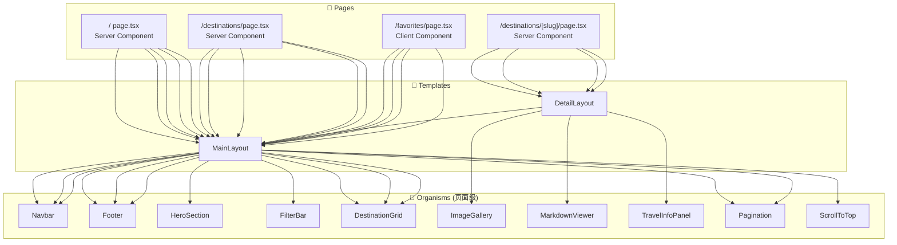
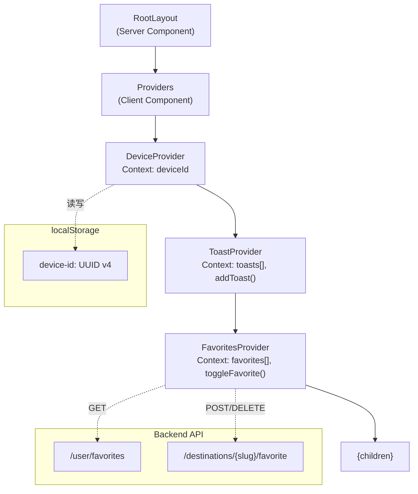
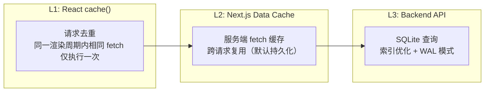
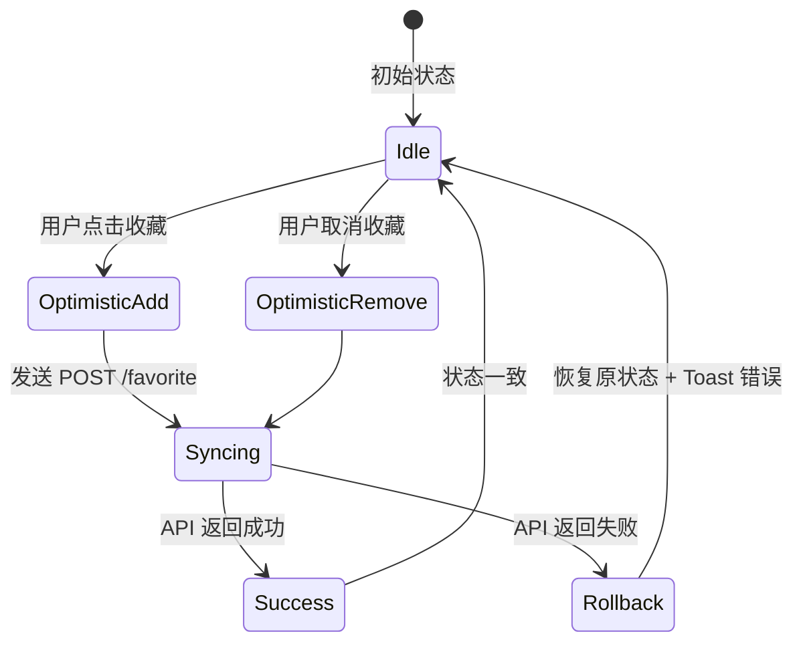

# 前端组件架构文档 — 「100种不可思议旅行」

> **版本**: v1.0 MVP  
> **日期**: 2026-06-05  
> **文档类型**: 前端技术文档

---

## 目录

1. [项目结构](#1-项目结构)
2. [组件目录](#2-组件目录)
3. [组件树](#3-组件树)
4. [状态管理](#4-状态管理)
5. [路由设计](#5-路由设计)
6. [数据获取策略](#6-数据获取策略)
7. [样式系统](#7-样式系统)
8. [关键交互实现](#8-关键交互实现)

---

## 1. 项目结构

```
src/
├── app/                          # Next.js App Router 页面
│   ├── globals.css               # 全局样式 + 动画关键帧
│   ├── layout.tsx                # 根布局（字体 + Providers + Metadata）
│   ├── page.tsx                  # 首页 /
│   ├── providers.tsx             # Client Providers 组成
│   ├── loading.tsx               # 全局加载骨架屏
│   ├── error.tsx                 # 全局错误边界
│   ├── not-found.tsx             # 全局 404 页面
│   ├── destinations/
│   │   ├── page.tsx              # /destinations 列表页
│   │   ├── loading.tsx           # 列表页加载骨架屏
│   │   └── [slug]/
│   │       ├── page.tsx          # /destinations/[slug] 详情页
│   │       ├── loading.tsx       # 详情页加载骨架屏
│   │       ├── not-found.tsx     # 目的地 404
│   │       └── ViewTracker.tsx   # 浏览记录客户端组件
│   ├── categories/
│   │   ├── page.tsx              # /categories 全部分类
│   │   └── [slug]/
│   │       └── page.tsx          # /categories/[slug] 分类筛选
│   └── favorites/
│       └── page.tsx              # /favorites 我的收藏
│
├── components/
│   ├── atoms/                    # ⚛️ 原子组件 (12)
│   │   ├── index.ts
│   │   ├── Button.tsx            # 4 variants, 3 sizes, loading + disabled
│   │   ├── Badge.tsx             # 5 variants, 2 sizes
│   │   ├── Tag.tsx               # Chip-style tag
│   │   ├── Spinner.tsx           # SVG spinner, 3 sizes
│   │   ├── Skeleton.tsx          # 4 variants (text/circular/rect/card)
│   │   ├── Icon.tsx              # Lucide 动态图标包装
│   │   ├── Input.tsx             # 带 icon + clear + error
│   │   ├── Select.tsx            # 原生 select 样式
│   │   ├── Tooltip.tsx           # 位置感知 + delay
│   │   ├── Divider.tsx           # 水平/垂直 + label
│   │   ├── Typography.tsx        # H1-H6, Body, Caption, Label
│   │   └── OptimizedImage.tsx    # next/image 包装 (loading/error states)
│   │
│   ├── molecules/                # 🔗 分子组件 (12)
│   │   ├── index.ts
│   │   ├── DestinationCard.tsx   # 卡片：图片 + badges + title + stats + 收藏
│   │   ├── SkeletonCard.tsx      # DestinationCard 的骨架版
│   │   ├── FilterGroup.tsx       # Chip/Dropdown 筛选组
│   │   ├── FavoriteButton.tsx    # 心形切换 + 动画 + 乐观更新
│   │   ├── RatingStar.tsx        # 5 星评分（CSS 部分填充）
│   │   ├── StatBadge.tsx         # 图标 + 格式化数值
│   │   ├── Breadcrumb.tsx        # 面包屑导航
│   │   ├── TagChip.tsx           # 可点击标签（导航至筛选列表）
│   │   ├── CategoryBadge.tsx     # 分类卡片（icon + name + desc + count）
│   │   ├── SearchBar.tsx         # 防抖搜索 + 键盘支持
│   │   ├── BackToTop.tsx         # 滚动感知浮动按钮
│   │   └── ShareButton.tsx       # Web Share API / 剪贴板复制
│   │
│   ├── organisms/                # 🧩 有机体组件 (10)
│   │   ├── index.ts
│   │   ├── Navbar.tsx            # Sticky header + 移动端侧边面板
│   │   ├── Footer.tsx            # 3 列页脚
│   │   ├── HeroSection.tsx       # 渐变背景 + CTA + 统计条
│   │   ├── FilterBar.tsx         # 排序 + 展开式筛选面板 (6 维度)
│   │   ├── DestinationGrid.tsx   # Grid 容器 (loading/empty/error states)
│   │   ├── ImageGallery.tsx      # 主图 + 缩略图条 + 灯箱
│   │   ├── MarkdownViewer.tsx    # HTML 内容渲染 (prose)
│   │   ├── TravelInfoPanel.tsx   # Tab 式信息面板
│   │   ├── Pagination.tsx        # 移动端 prev/next + 桌面端编号
│   │   └── ScrollToTop.tsx       # BackToTop 的页面级包装
│   │
│   └── templates/                # 📐 模板组件 (2)
│       ├── MainLayout.tsx        # Navbar + main + Footer + BackToTop
│       └── DetailLayout.tsx      # 2 列详情页布局 (sidebar + content)
│
├── hooks/                        # 🪝 自定义 Hooks
│   ├── index.ts                  # 统合导出 + useToast + useFavorites
│   ├── useDeviceId.ts            # 从 DeviceProvider 读取 UUID
│   ├── useDebounce.ts            # 通用防抖 Hook
│   ├── useScrollPosition.ts      # rAF 节流滚动位置跟踪
│   └── useRecordView.ts          # 浏览记录 (mount 发送 + sendBeacon)
│
├── providers/                    # 📦 React Context Providers
│   ├── DeviceProvider.tsx        # UUID 生成/存储 (localStorage)
│   ├── ToastProvider.tsx         # Toast 通知系统 (2s 自动关闭)
│   └── FavoritesProvider.tsx      # 收藏状态 (乐观更新 + API 同步)
│
├── lib/                          # 🔧 工具库
│   ├── api-client.ts             # 类型化 fetch 封装 + API 函数
│   ├── api-errors.ts             # ApiRequestError 类 + 错误消息映射
│   └── data.ts                   # React cache() 包装的数据获取函数
│
└── types/
    └── api.ts                    # 完整 TypeScript 类型定义
```

---

## 2. 组件目录

### 2.1 Atoms（12 个）

| 组件 | 文件 | Props 关键 | 状态 |
|------|------|-----------|------|
| **Button** | `atoms/Button.tsx` | variant, size, loading, disabled, href | default, hover, focus, active, loading, disabled |
| **Badge** | `atoms/Badge.tsx` | variant (5 色), size (sm/default) | — |
| **Tag** | `atoms/Tag.tsx` | active, href, removable | active/inactive, hover |
| **Spinner** | `atoms/Spinner.tsx` | size (sm/md/lg) | 旋转动画 |
| **Skeleton** | `atoms/Skeleton.tsx` | variant (text/circular/rect/card) | animate-pulse |
| **Icon** | `atoms/Icon.tsx` | name (Lucide icon), size, className | — |
| **Input** | `atoms/Input.tsx` | icon, clearable, error, value | default, focus, error, disabled |
| **Select** | `atoms/Select.tsx` | options, value, onChange | default, focus, disabled |
| **Tooltip** | `atoms/Tooltip.tsx` | content, position (top/bottom/left/right), delay | show/hide |
| **Divider** | `atoms/Divider.tsx` | orientation (horizontal/vertical), label | — |
| **Typography** | `atoms/Typography.tsx` | variant (h1-h6/body/caption/label), as | — |
| **OptimizedImage** | `atoms/OptimizedImage.tsx` | src, alt, width, height, fill, priority | loading, loaded, error, fallback |

### 2.2 Molecules（12 个）

| 组件 | 组合的 Atoms | 关键交互 |
|------|-------------|---------|
| **DestinationCard** | OptimizedImage, Badge, Typography, StatBadge, FavoriteButton | 点击跳转详情页，hover 放大封面图 |
| **SkeletonCard** | Skeleton | 精确匹配 DestinationCard 布局 |
| **FilterGroup** | Tag / Select | 多选 toggle / 单选 switch |
| **FavoriteButton** | Button, Spinner, Icon | 点击 toggle → 动画 → API 同步 |
| **RatingStar** | Icon (Star) | CSS 部分填充 (0-5 精度 0.1) |
| **StatBadge** | Icon, Typography | 数值格式化 (12.6k) |
| **Breadcrumb** | Typography, Icon | 自动计算路径层级 |
| **TagChip** | Tag | 点击导航至 `/destinations?tags=...` |
| **CategoryBadge** | OptimizedImage, Typography | 点击跳转分类筛选页 |
| **SearchBar** | Input, Icon | 防抖 300ms + Enter 键 + 清除按钮 |
| **BackToTop** | Button, Icon | 滚动 > 300px 显示，点击平滑滚到顶部 |
| **ShareButton** | Button, Icon | Web Share API (mobile) 或剪贴板复制 (desktop) |

### 2.3 Organisms（10 个）

| 组件 | 组合的 Molecules/Atoms | 职责 |
|------|----------------------|------|
| **Navbar** | Button, Icon, CategoryBadge | 粘性导航 + 分类下拉 + 移动端侧边面板 |
| **Footer** | Typography, Icon | 3 列页脚 (关于/快捷链接/统计数据) |
| **HeroSection** | Typography, Button, StatBadge | 渐变背景 Hero + CTA 双按钮 + 统计条 |
| **FilterBar** | Select, FilterGroup, Tag | 排序下拉 + 展开式多维度筛选面板 |
| **DestinationGrid** | DestinationCard, SkeletonCard | Grid 布局 (responsive cols) + 空状态/错误/加载 |
| **ImageGallery** | OptimizedImage, Button, Icon | 主图 + 缩略图条 + 全屏灯箱 (键盘/触摸) |
| **MarkdownViewer** | Typography, OptimizedImage | 使用 `prose` 样式渲染 HTML 内容 |
| **TravelInfoPanel** | Typography, Badge, Divider | Tab 切换面板 (信息/实用/交通/贴士/趣闻) |
| **Pagination** | Button, Icon | 移动端 prev/next + 桌面端编号 + 省略号 |
| **ScrollToTop** | BackToTop | 页面级包装，提供 floated 定位 |

### 2.4 Templates（2 个）

| 模板 | 组成 | 使用页面 |
|------|------|---------|
| **MainLayout** | Navbar + `<main>{children}</main>` + Footer + ScrollToTop | `/`, `/destinations`, `/categories`, `/favorites` |
| **DetailLayout** | MainLayout + 2 列网格 (sidebar + content) | `/destinations/[slug]` |

---

## 3. 组件树



---

## 4. 状态管理

### 4.1 Provider 层级



### 4.2 状态流向

| 状态 | 存储位置 | 更新方式 | 同步方向 |
|------|---------|---------|---------|
| Device UUID | localStorage → DeviceContext | 首次访问生成，后续读取 | 客户端独有 |
| 收藏列表 | FavoritesContext | 乐观更新 → API 同步 → 回滚不一致 | 双向 |
| Toast 通知 | ToastContext (内存队列) | addToast() → 2s 后 auto-remove | 客户端独有 |
| 筛选条件 | URL searchParams | 修改参数 → router.push() | URL → 服务端 |
| 滚动位置 | useScrollPosition (rAF 节流) | scroll 事件监听 | 客户端独有 |

---

## 5. 路由设计

### 5.1 路由表

| 路径 | 文件 | 渲染策略 | 数据获取 |
|------|------|---------|---------|
| `/` | `app/page.tsx` | Server | `getPopularDestinations()`, `getNewestDestinations()`, `getCategories()` |
| `/destinations` | `app/destinations/page.tsx` | Server | `getDestinations(searchParams)` |
| `/destinations/[slug]` | `app/destinations/[slug]/page.tsx` | Server | `getDestinationDetail(slug)` |
| `/categories` | `app/categories/page.tsx` | Server | `getCategories()` |
| `/categories/[slug]` | `app/categories/[slug]/page.tsx` | Server | `getDestinations({ category: slug })` |
| `/favorites` | `app/favorites/page.tsx` | Client | `fetchUserFavorites(deviceId)` |

### 5.2 并行路由与加载状态

```
/destinations
├── loading.tsx        ← 骨架屏 (SkeletonCard × 8)
├── page.tsx           ← 默认视图
└── error.tsx          ← 错误边界

/destinations/[slug]
├── loading.tsx        ← 骨架屏 (2 列布局)
├── page.tsx           ← 默认视图
└── not-found.tsx      ← 目的地 404
```

---

## 6. 数据获取策略

### 6.1 三层缓存架构



### 6.2 数据获取函数 (`lib/data.ts`)

| 函数 | 用途 | 缓存策略 |
|------|------|---------|
| `getDestinations(params)` | 列表页数据获取 | `React.cache()` |
| `getDestinationDetail(slug)` | 详情页数据获取 | `React.cache()` |
| `getPopularDestinations()` | 首页热门 | `React.cache()` |
| `getNewestDestinations()` | 首页最新 | `React.cache()` |
| `getCategories()` | 分类列表 | `React.cache()` |
| `getTags()` | 标签列表 | `React.cache()` |

### 6.3 API 客户端 (`lib/api-client.ts`)

```typescript
// 类型安全的 fetch 封装
async function apiFetch<T>(path: string, options?: RequestInit): Promise<T>

// 领域 API 函数
export const destinationsApi = {
  list: (params: DestinationListParams) => ...,
  detail: (slug: string) => ...,
}

export const userApi = {
  toggleFavorite: (slug: string, deviceId: string) => ...,
  removeFavorite: (slug: string, deviceId: string) => ...,
  recordView: (slug: string, deviceId: string, duration?: number) => ...,
  listFavorites: (deviceId: string, page?: number) => ...,
}

export const metaApi = {
  categories: () => ...,
  tags: (sort?: string) => ...,
}
```

---

## 7. 样式系统

### 7.1 Tailwind 配置

```typescript
// tailwind.config.ts 核心配置
{
  theme: {
    extend: {
      colors: {
        primary: { 50-950 },  // 蓝色系
        accent: { 50-950 },   // 粉色系
      },
      fontFamily: {
        sans: ['Inter', 'Noto Sans SC', 'sans-serif'],
      },
    },
  },
  plugins: [
    require('@tailwindcss/typography'),  // Markdown 内容排版
  ],
}
```

### 7.2 响应式断点

| 断点 | 宽度 | 设计策略 |
|------|------|---------|
| `sm` | 640px | 手机横屏 |
| `md` | 768px | 平板竖屏 |
| `lg` | 1024px | 平板横屏 / 小桌面 |
| `xl` | 1280px | 桌面 |
| `2xl` | 1536px | 大桌面 |

### 7.3 自定义动画

| 动画名 | 用途 | 关键帧 |
|--------|------|--------|
| `heart-beat` | 收藏成功时心形动画 | scale(1) → scale(1.3) → scale(1) |
| `fade-in` | 内容淡入 | opacity(0) → opacity(1) |
| `slide-in-right` | 移动侧边面板 | translateX(100%) → translateX(0) |

---

## 8. 关键交互实现

### 8.1 乐观收藏更新



### 8.2 图片灯箱键盘导航

| 按键 | 行为 |
|------|------|
| `←` / `ArrowLeft` | 上一张图片 |
| `→` / `ArrowRight` | 下一张图片 |
| `Escape` | 关闭灯箱 |
| `Space` | 切换灯箱打开/关闭 |

### 8.3 搜索防抖

```
用户输入 → 300ms debounce → 更新 URL searchParams → 触发列表重新获取
```

---

> **版本历史**  
> - v1.0 (2026-06-05) — MVP 前端架构文档初版  
> - 配套文档：[架构设计](./architecture.md) · [API 契约](./api_spec.md)
